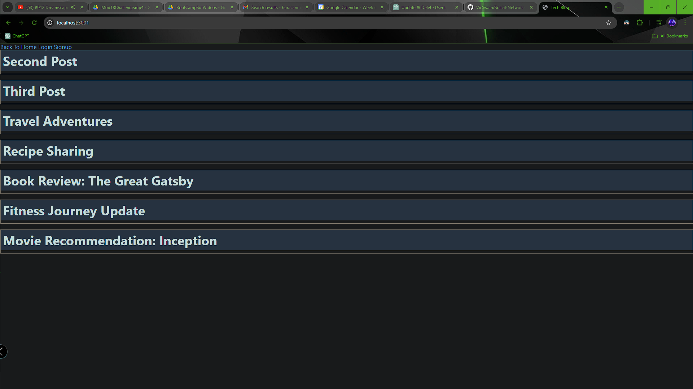
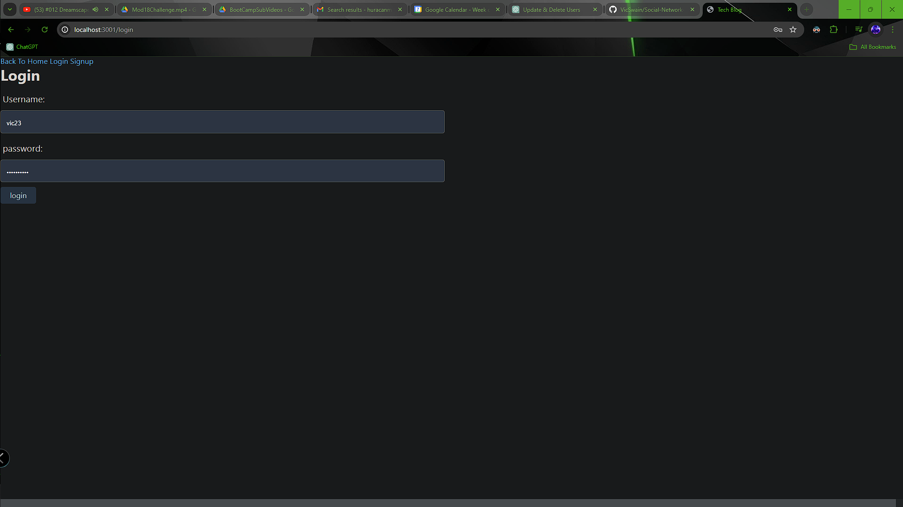
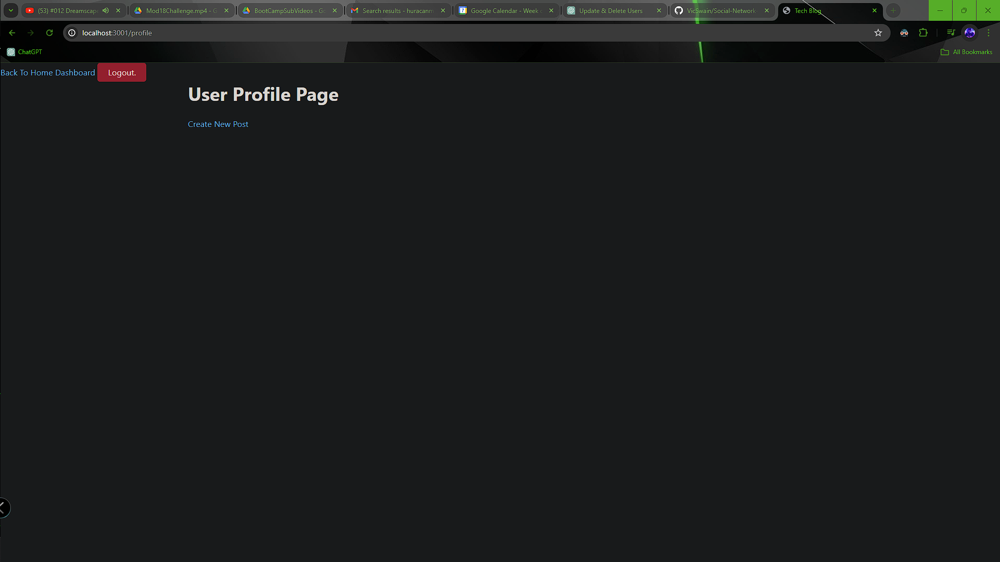
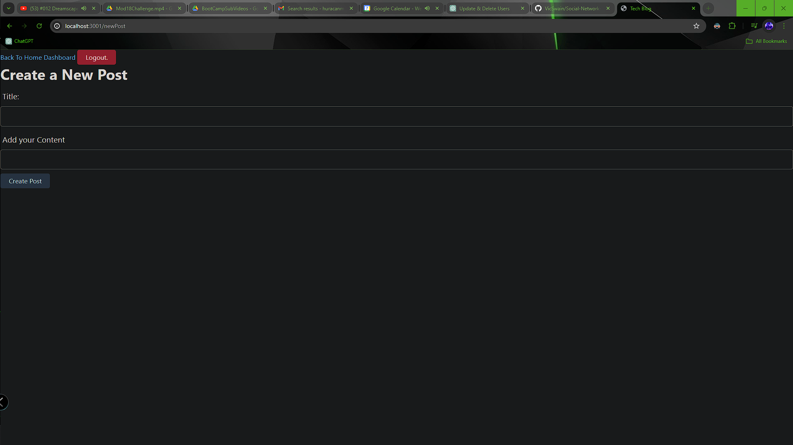
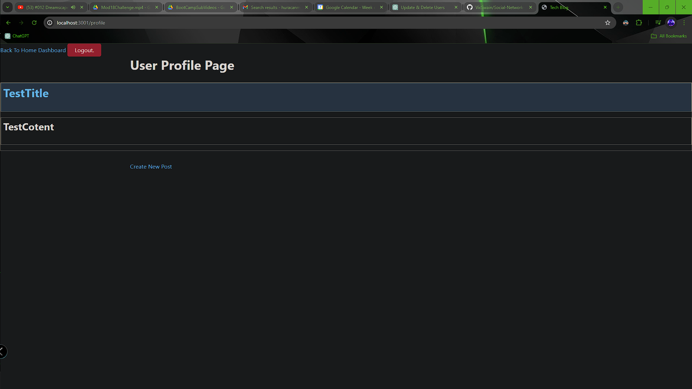
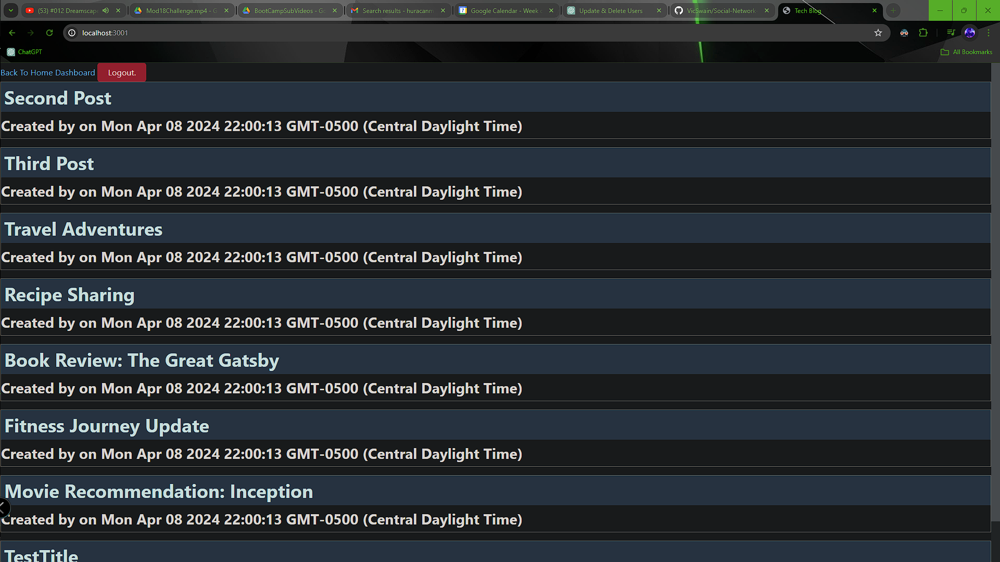
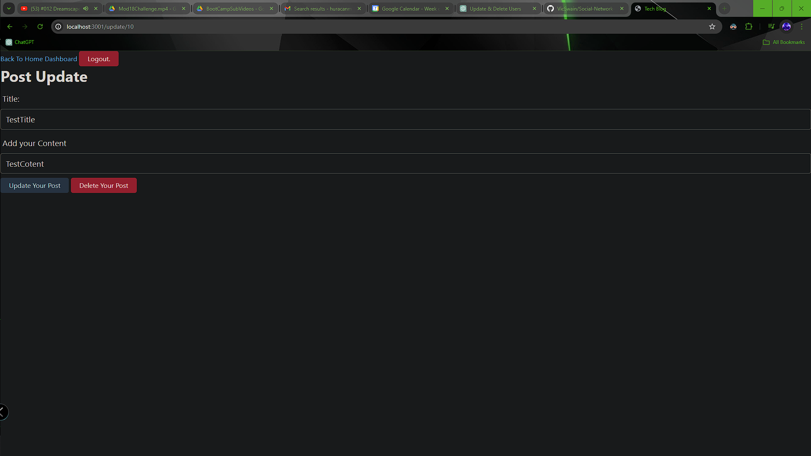

  # Tech Blog

  ## Description
  This project is a DMS style blog site build with Node.JS Express.JS Handlebars.JS Express Session, and protected with dotenv and bcrpyt. A users is presented with a landing page including a nav bar with the option to log in or sign up, and a few blog posts.  A user must be signed in for full functionality, and will be able to see post content, who created it, and when it was created.  When a user signs up they are asked to create a username and password. Once singed up and/or logged in, the user is presented with a  dashboard contining their posts.  The user can navigate and see all details on others posts, as well as post or delete comments on existing topics, and delete their posts. This is a full CRUD app.

  ## Table of Contents
  [Installation](#installation)

  [Usage](#usage)

  [License](#license)

  [Contributors](#contributors)

  [Tests](#tests)

  [Questions](#questions)

  ### Installation
  1. npm i 
  2. npm run seed

  ### Usage
  npm run start

  ### Screenshots
  
  
  
  
  
  
  

  ### Contributors
  I pair programmed with Becky Feltman on this project

  ### Questions
  [GIT AT ME!](https://github.com/VicSwain)
  
  [REACH ME](@huracanmusic2016@gmail.com)
  
  #### Tests
  N/A
  
  #### License 
  No license;

  This project is not protected!;